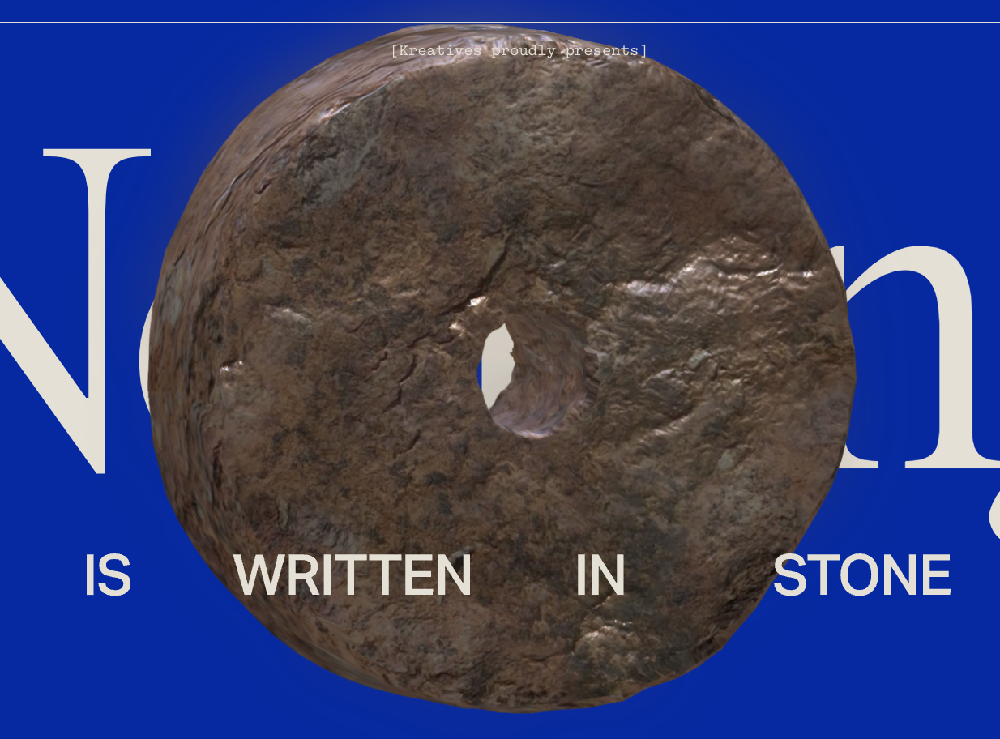
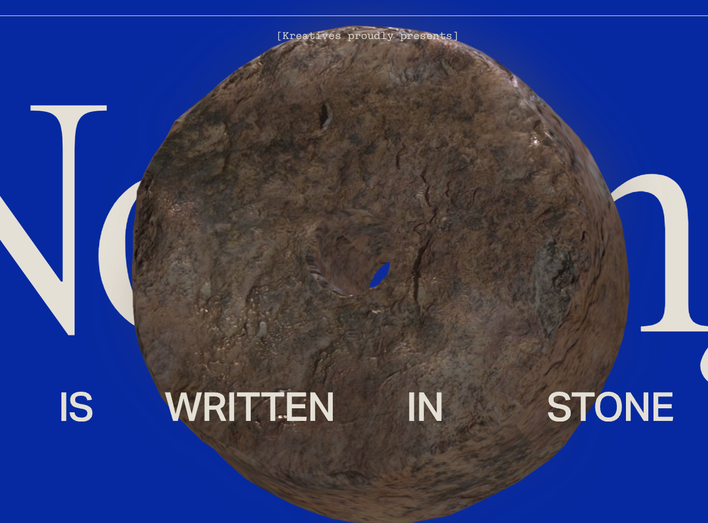
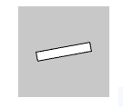
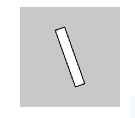

# mson0798_9103_tut1

My first repository for IDEA9103

This is my first local change to the repo!

## Week 8 Quiz

1. Part 1

The major project encourages us to recreate the provided artwork in our own interpretation rather than just copying it. I wanted to incorporate some interactivity to invite viewers to be involved in the art and have fun with it. In viewing Kreatives’ design project, “Nothing is written in stone”, I am inspired by how the artwork rotates in accordance with the mouse position, allowing the viewer to interact and play with the artwork. I plan to incorporate a similar rotating element in my assignment which would be an easy yet effective way to enhance the immersion, achieving my goal.

[A link to "Nothing is written in stone" by Kreatives](https://www.kreatives.co/stone)

2. Part 2

In the example of the “Nothing is written in stone” design project, the rotating stone is rendered in a 3d graphic. The stone is rotating by default but through moving the mouse position, the viewer is able to control the angle in which the stone rotates (showcasing the 3d element). As this is too challenging for me to implement, I plan to create an artwork using a similar technique but in 2d form which rotates as the mouse is moved around. The function I will be using is atan2() in which rotate() function is included. By using them, I can achieve the desired effect.

[A link to the atan2() function](https://p5js.org/reference/#/p5/atan2)
[A link to the rotate() function](https://p5js.org/reference/#/p5/rotate)
